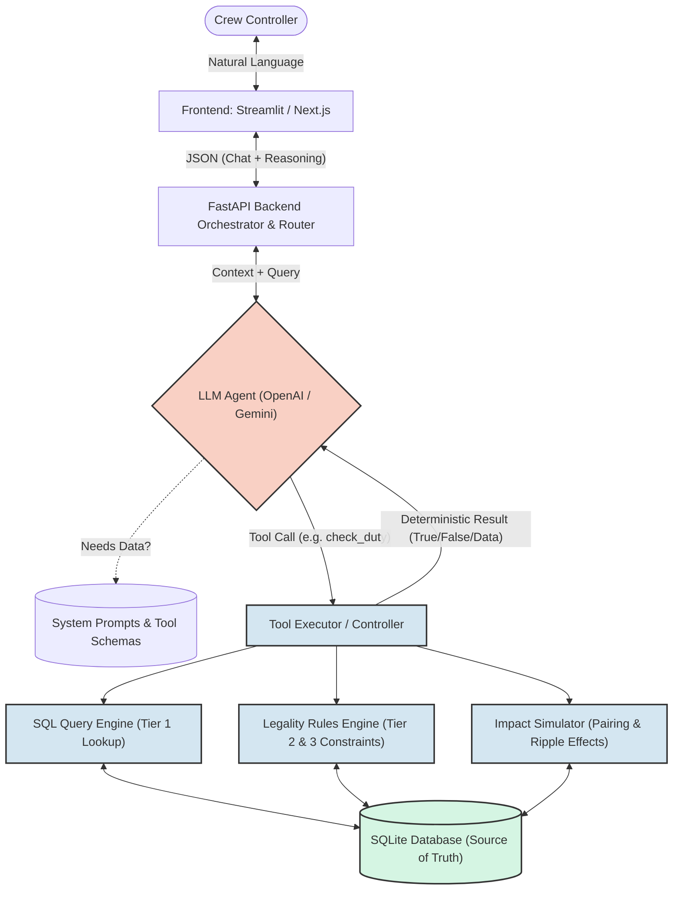

# System Architecture: Agentic Crew Ops Advisor

This architecture is designed following **ByteByteGo GenAI System Design** principles (specifically adapting the *ChatGPT/Agent* and *Retrieval-Augmented Generation (RAG)* patterns). It enforces a strict boundary between probabilistic reasoning (the LLM) and deterministic evaluation (the rules engine/math), ensuring reliability, fault tolerance, and absolute explainability.

## 1. High-Level Architecture Diagram

---

## 2. ByteByteGo Design Decisions

### A. Separation of Concerns (The LLM / Deterministic Boundary)
*   **The Problem:** LLMs are highly probabilistic and fail at exact arithmetic (e.g., duty hour calculations). In aviation, a 1-minute duty limit violation is illegal.
*   **The ByteByteGo Pattern:** Use the **Agentic / Tool-Calling Pattern**. The LLM is restricted to being a *semantic router* and *synthesizer*. 
*   **Decision:** All exact math, rule validation (`rules.json`), and downstream consequence tracing (ripple effects in `rosters.json`) must be executed in pure Python (The Deterministic Engines). The LLM is given strict Pydantic schemas defining tools like `check_rule_fdp_01(crew_id, target_flight)`.

### B. Reliability & Fault Tolerance
*   **The Problem:** The LLM might generate a malformed tool call, or hallucinate a `crew_id` that doesn't exist in the SQLite database.
*   **Decision (Data Integrity):** The Python Tool Executor wraps all database queries in `try/except` blocks. If the LLM passes an invalid `crew_id`, the Python engine catches the SQL error and returns a strict fallback string to the LLM: `"ERROR: Crew ID not found. Prompt the user for clarification."`
*   **Decision (Handling System Limits):** As per the hackathon requirements, *honest failure* is rewarded. The System Prompt is instructed: `"If the Tool Executor returns an error, DO NOT guess the answer. Inform the controller that the data is unavailable."`

### C. The RAG Adaptation (Structured Retrieval)
*   **The Problem:** Traditional RAG uses vector databases (Chroma/Pinecone) for semantic search. We are dealing with relational, exact data.
*   **The ByteByteGo Pattern:** Structured Data Retrieval.
*   **Decision:** We load all JSON files into a single, local **SQLite Database**. The "Retrieval" step is handled by the `QueryEngine`, which accepts highly constrained parameters from the LLM (e.g., `date`, `station`, `role`) and executes predefined, optimized SQL queries to return exact tabular data back to the LLM's context window.

### D. Explainability & Observability (Mandatory for Hackathon)
*   **The Problem:** A controller must trust the AI. A black-box answer is an operational hazard.
*   **Decision:** The FastAPI backend returns a structured JSON payload to the Frontend containing two parts:
    1.  The `answer` (The natural language response).
    2.  The `reasoning_trail` (An array of all tools called, the arguments passed to them, and the raw deterministic result returned by SQLite/Python).
*   **UI Implementation:** The Streamlit/React frontend will display the natural language answer, with a collapsible "View Reasoning" accordion showing the exact rule calculations and database lookups, ensuring 100% transparency.

---

## 3. Data Ingestion Pipeline (Pre-Flight)

Before the server starts, an initialization script (ETL) must run:
1.  Read all `data/*.json` files.
2.  Parse relationships (e.g., linking a Crew ID in `rosters.json` to `crew.json`).
3.  Write this structured data into local `airline.db` (SQLite) using Pandas or native `sqlite3`. 
4.  *Benefit:* Zero network latency for database queries, enabling sub-second response times for the deterministic layer.
