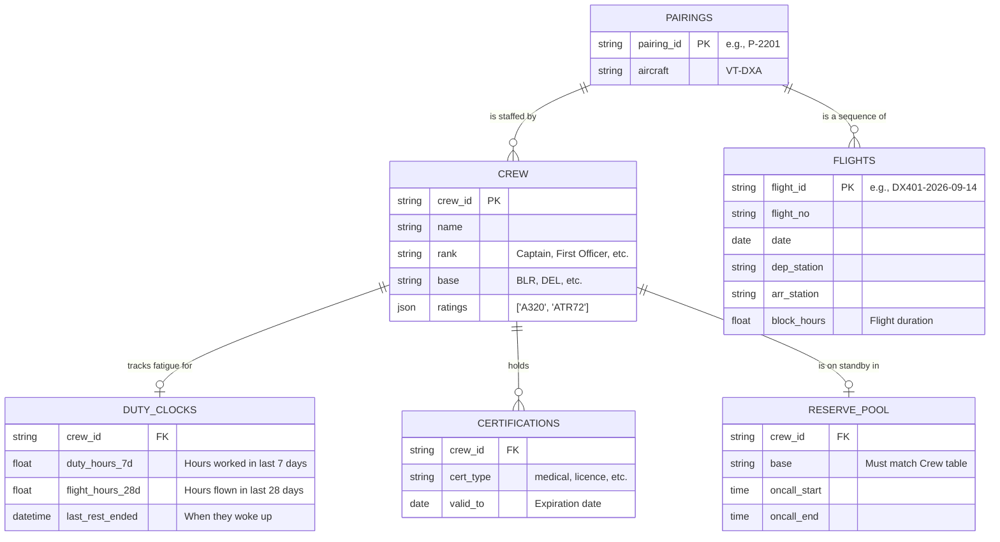

# 🛫 Hackathon Handover Guide: Crew Ops Advisor

This document is your ultimate cheat sheet for the hackathon. It breaks down the dataset relationships, the system architecture, and the exact logic behind every single aviation rule.

---

## Part 1: The Dataset & Relational Schema

While the data was given to you as a bunch of `.json` files, it is actually a highly structured Relational Database. Think of it exactly like PostgreSQL tables.

### Entity Relationship (ER) Diagram

### How the Data Connects
1.  **`crew_id` is the center of the universe:** If you want to know a pilot's fatigue, you join `crew` with `duty_clocks` on `crew_id`. If you want to know if their medical license is valid, you join with `certifications`.
2.  **The "Pairing":** A pairing (`rosters.json`) is the bridge between a `crew_id` and a `flight_id`. A crew member doesn't just get assigned to "Flight 401". They get assigned to "Pairing 2201", which *contains* Flight 401, 402, 403, and 404. **This is the Ripple Effect.** If a pilot drops out of a pairing, all flights in that pairing lose their pilot.

---

## Part 2: The Architecture (Node.js/TypeScript)

You are building an **Agentic RAG (Retrieval-Augmented Generation) System**. 

### Why this architecture?
LLMs (like GPT-4) are terrible at strict math and rule evaluation. If you paste the rule *"Max 13 hours duty, minus 0.5h for every sector past the second"* into a prompt, the LLM will hallucinate the math 20% of the time. In aviation, a 1-minute violation is illegal. 

Therefore, you have a **Strict Deterministic Boundary**:
1.  **The LLM** is just a router. It reads the user's question, understands the intent, and decides *which* TypeScript function to call.
2.  **Zod & `zod-to-json-schema`** act as the bridge. They translate your strict TypeScript types into a JSON schema that OpenAI understands for "Tool Calling".
3.  **The `rulesEngine.ts`** is the strict calculator. It executes standard TypeScript math and queries `better-sqlite3`. It never guesses. It returns a strict `RuleResult` (`{ legal: boolean, reason: string }`).
4.  **The LLM** takes that returned `reason` string and formulates a polite, human-readable response for the Crew Controller.

---

## Part 3: The 7 Rules Explained

Here is the plain English explanation of each rule, and exactly how `src/rulesEngine.ts` enforces it.

### RULE-FDP-01: Flight Duty Period limits
*   **The Rule:** A pilot can work a maximum of 13 hours in a shift. However, taking off and landing is exhausting. So, for every flight (sector) they fly *after* their second flight of the day, you must subtract 30 minutes (0.5h) from that 13-hour limit.
*   **How the code handles it:** Pure math.
    *   `penaltySectors = Math.max(0, numSectors - 2)`
    *   `maxAllowed = 13.0 - (penaltySectors * 0.5)`
    *   If they fly 4 sectors, the penalty is 2. The max limit drops to 12.0 hours.

### RULE-DUTY-02: 7-Day Cumulative Duty Limits
*   **The Rule:** A crew member cannot work more than 60 hours in a rolling 7-day window.
*   **How the code handles it:** State check. The code queries `duty_clocks.json` via SQLite to find how many hours the pilot has *already* worked this week. It adds the proposed new shift hours. If `current + new > 60`, it blocks the assignment.

### RULE-FLT-03: 28-Day Cumulative Flight Hours Limit
*   **The Rule:** A crew member cannot spend more than 100 hours actually flying the plane (block hours) in a 28-day window.
*   **How the code handles it:** Identical to Duty-02, but checks the `flight_hours_28d` column instead.

### RULE-REST-04: Minimum 12h Rest
*   **The Rule:** When a crew member finishes a shift (release time), they must have a minimum of 12 continuous hours of rest before their next shift begins (report time).
*   **How the code handles it:** The dataset generator already calculated when their last 12-hour rest ended and saved it as `last_rest_ended` in the database. The code simply checks if the `newReportUtc` timestamp is *greater than* or equal to the `last_rest_ended` timestamp. 

### RULE-QUAL-05: Aircraft Rating
*   **The Rule:** Pilots are licensed for specific plane models. You cannot put an Airbus A320 pilot in a Boeing 737 or an ATR72.
*   **How the code handles it:** Queries the `crew` table in SQLite, parses the `ratings` JSON array (e.g., `["A320"]`), and checks if the `targetAircraftType` exists in that array using `.includes()`.

### RULE-CERT-06: Certification Validity
*   **The Rule:** Crew members have medical licenses and recurrent training certificates that expire. They cannot fly on a day where their certificate is expired.
*   **How the code handles it:** It scans the `certifications.json` array in memory. If a pilot's `valid_to` date is *before* the proposed `dutyDate`, the system flags it as illegal. *(Note: The hackathon dataset has an intentional trap—a cabin crew member's training expires mid-week. This rule catches them!)*

### RULE-BASE-07: Reserve Callout & Deadheading
*   **The Rule:** You want to use backup (reserve) pilots who live in the city where the plane is broken. If a plane breaks in Delhi (DEL), but you only have a reserve pilot in Bengaluru (BLR), you have to fly the BLR pilot to DEL as a passenger (Deadhead) before they can start working.
*   **How the code handles it:** It checks the pilot's `base`. If it matches the departure station, it's legal and cheap. If it doesn't match, it is *still legal*, but the code flags `cost_incurred: true`, meaning the AI should rank this option lower because buying a passenger ticket for a pilot is expensive.
